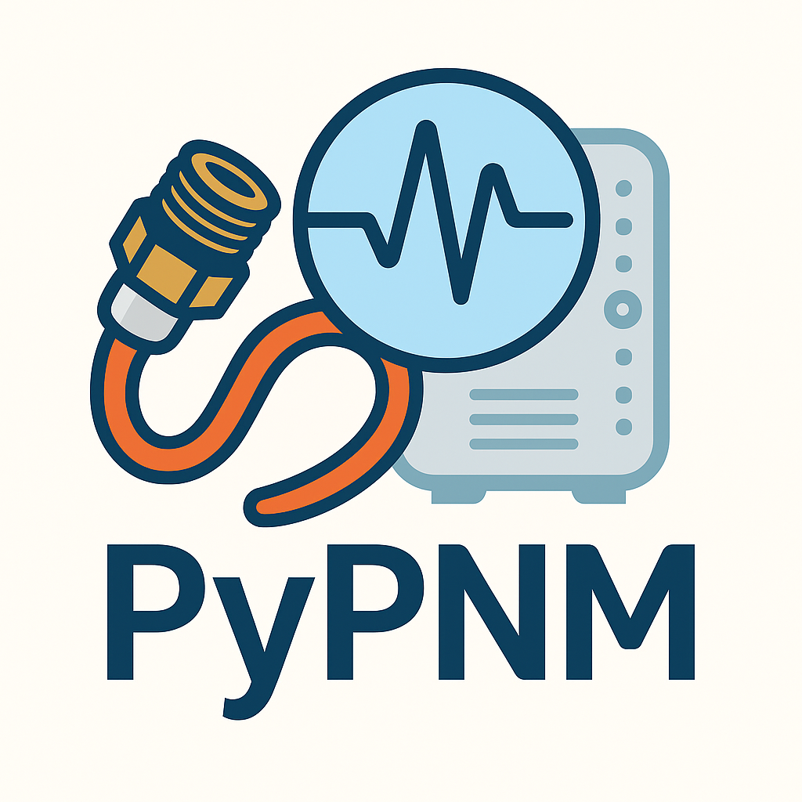

<p align="center">
  <a href="docs/index.md">
    <picture>
      <source srcset="docs/images/logo/pypnm-dark-mode-hp.png"
              media="(prefers-color-scheme: dark)" />
      
    </picture>
  </a>
</p>

# PyPNM - Proactive Network Maintenance Toolkit

[](https://github.com/PyPNMApps/PyPNM/tags)
[](https://pypi.org/project/pypnm-docsis/)
[](https://pypi.org/project/pypnm-docsis/)
[](https://github.com/PyPNMApps/PyPNM/actions/workflows/daily-build.yml)

[](https://github.com/PyPNMApps/PyPNM/actions/workflows/pypi-install-check.yml)
[](https://github.com/PyPNMApps/PyPNM/actions/workflows/kubernetes-kind.yml)
[](https://github.com/PyPNMApps/PyPNM/actions/workflows/publish-ghcr.yml)
[](https://github.com/PyPNMApps/PyPNM/pkgs/container/pypnm)
[](./LICENSE)
[](https://github.com/PyPNMApps/PyPNM)

PyPNM is a DOCSIS 3.x/4.0 Proactive Network Maintenance toolkit for engineers who want repeatable, scriptable visibility into modem health. It can run purely as a Python library or as a FastAPI web service for real-time dashboards and offline analysis workflows.

## Table of contents

- [Choose your path](#choose-your-path)
- [Kubernetes | Docker](#kubernetes--docker)
  - [Docker](#docker-deploy)
  - [Kubernetes (kind)](#k8s-deploy)
- [Key Features](#key-features)
- [Prerequisites](#prerequisites)
  - [Operating Systems](#operating-systems)
  - [Shell Dependencies](#shell-dependencies)
- [Getting Started](#getting-started)
  - [Install From PyPI (Library Only)](#install-from-pypi-library-only)
  - [1) Clone](#1-clone)
  - [2) Install](#2-install)
  - [3) Activate The Virtual Environment](#3-activate-the-virtual-environment)
  - [4) Configure System Settings](#4-configure-system-settings)
  - [5) Run The FastAPI Service Launcher](#5-run-the-fastapi-service-launcher)
  - [6) (Optional) Serve The Documentation](#6-optional-serve-the-documentation)
  - [7) Explore The API](#7-explore-the-api)
- [Documentation](#documentation)
- [Gallery](docs/gallery/index.md)
- [SNMP Notes](#snmp-notes)
- [CableLabs Specifications & MIBs](#cablelabs-specifications--mibs)
- [PNM Architecture & Guidance](#pnm-architecture--guidance)
- [License](#license)
- [Maintainer](#maintainer)

## Choose your path

| Path | Description |
| --- | --- |
| [Kubernetes deploy (kind)](#k8s-deploy) | Run PyPNM in a local kind cluster (GHCR image). |
| [Docker deploy](#docker-deploy) | Install and run the containerized PyPNM service. |
| [Use PyPNM as a library](#install-from-pypi-library-only) | Install `pypnm-docsis` into an existing Python environment. |
| [Run the full platform](#1-clone) | Clone the repo and use the full FastAPI + tooling stack. |

## Kubernetes | Docker

<a id="docker-deploy"></a>
### Docker (Recommended) - [Install Docker](docs/docker/install-docker.md) | [Install PyPNM Container](docs/docker/install.md) | [Commands](docs/docker/commands.md)

Fast install (helper script; latest release auto-detected):

```bash
TAG="v1.0.12.0"
PORT=8080

curl -fsSLo install-pypnm-docker-container.sh \
  https://raw.githubusercontent.com/PyPNMApps/PyPNM/main/scripts/install-pypnm-docker-container.sh

chmod +x install-pypnm-docker-container.sh

sudo ./install-pypnm-docker-container.sh --tag ${TAG} --port ${PORT}
```

If Docker isn’t on your host yet, follow the [Install Docker prerequisites](docs/docker/install-docker.md) guide first.

More Docker options and compose workflows: [PyPNM Docker Installation](docs/docker/install.md) and [Developer Workflow](docs/docker/commands.md#developer-workflow).

<a id="k8s-deploy"></a>
### Kubernetes (kind) dev clusters

Kubernetes quick links:
- [Install kind](docs/kubernetes/kind-install.md)
- [Deploy PyPNM](docs/kubernetes/pypnm-deploy.md)
- [kind + FreeLens (VM)](docs/kubernetes/kind-freelens.md)

We continuously test the manifests with a kind-based CI smoke test (`Kubernetes (kind)` badge above). Follow the [kind quickstart](docs/kubernetes/quickstart.md) or the [detailed deployment guide](docs/kubernetes/pypnm-deploy.md) to run PyPNM inside a local single-node cluster; multi-node scenarios are not covered yet (see [pros/cons](docs/kubernetes/pros-cons.md)).

Script-only deployment (no repo clone) is documented in [PyPNM deploy](docs/kubernetes/pypnm-deploy.md#script-only-deploy-no-repo-clone).

## Prerequisites

### Operating systems

Linux, validated on:

- Ubuntu 22.04 LTS
- Ubuntu 24.04 LTS

Other modern Linux distributions may work but are not yet part of the test matrix.

### Shell dependencies

From a fresh system, install Git:

```bash
sudo apt update
sudo apt install -y git
```

Python and remaining dependencies are handled by the installer.

## Getting started

### Install from PyPI (library only)

If you only need the library, install from PyPI:

  ```bash
  pip install pypnm-docsis
  ```

Uninstall and cleanup:

  ```bash
  pip uninstall pypnm-docsis
  rm -f ~/.ssh/pypnm_secrets.key
  ```

For full FastAPI service usage and development, use the repository-based flow below.

### 1) Clone

  ```bash
  git clone https://github.com/PyPNMApps/PyPNM.git
  cd PyPNM
```

### 2) Install

Run the installer:

  ```bash
  ./install.sh
  ```

Common flags (use as needed):

| Flag | Purpose |
|------|---------|
| `--development` | Installs Docker Engine + kind/kubectl. See [Development Install](docs/install/development.md). |
| `--clean`       | Removes prior install artifacts (venv/build/dist/cache) before installing. Preserves data and system configuration. |
| `--purge-cache` | Clears pip cache after activating the venv (use with `--clean` when troubleshooting stale installs). |
| `--pnm-file-retrieval-setup` | Launches `tools/pnm/pnm_file_retrieval_setup.py` after install. See the [PNM File Retrieval Overview](docs/topology/index.md). |
| `--demo-mode`   | Seeds demo data/paths for offline exploration. See the [demo mode guide](./demo/README.md). |
| `--production`  | Reverts demo-mode changes and restores your previous `system.json` backup. |

Installer extras: adds shell aliases when available; source your rc file once to pick them up.

### 3) Activate the virtual environment

If you used the installer defaults, activate the `.env` environment:

  ```bash
  source .env/bin/activate
  ```


### 4) Configure system settings

System configuration lives in [deploy/docker/config/system.json](https://github.com/PyPNMApps/PyPNM/blob/main/deploy/docker/config/system.json).

- [Config menu](docs/system/menu.md): `source ~/.bashrc && config-menu`
- [System Configuration Reference](docs/system/system-config.md): field-by-field descriptions and defaults
If you installed with `--pnm-file-retrieval-setup`, it runs automatically and backs up `system.json` first.

<!-- Removed duplicated Step 3/4 block -->

### 5) [Run the FastAPI service launcher](docs/system/pypnm-cli.md)

HTTP (default: `http://127.0.0.1:8000`):

  ```bash
  pypnm
  ```

Development hot-reload:

  ```bash
  pypnm --reload
  ```

### 6) (Optional) Serve the documentation

HTTP (default: `http://127.0.0.1:8001`):

  ```bash
  mkdocs serve
  ```

### 7) Explore the API

Installed services and docs are available at the following URLs:

| Git Clone | Docker |
|-----------|--------|
| [FastAPI Swagger UI](http://localhost:8000/docs)  | [FastAPI Swagger UI](http://localhost:8080/docs)  |
| [FastAPI ReDoc](http://localhost:8000/redoc)      | [FastAPI ReDoc](http://localhost:8080/redoc)      |
| [MkDocs docs](http://localhost:8001)              | [MkDocs docs](http://localhost:8081)              |

## Documentation

- [Docs hub](./docs/index.md) - task-based entry point (install, configure, operate, contribute).
- [FastAPI reference](./docs/api/fast-api/index.md) - Endpoint details and request/response schemas.
- [Python API reference](./docs/api/python/index.md) - Importable helpers and data models.

## SNMP notes

- SNMPv2c is supported  
- SNMPv3 is currently stubbed and not yet supported

## CableLabs specifications & MIBs

- [CM-SP-MULPIv3.1](https://www.cablelabs.com/specifications/CM-SP-MULPIv3.1)  
- [CM-SP-CM-OSSIv3.1](https://www.cablelabs.com/specifications/CM-SP-CM-OSSIv3.1)  
- [CM-SP-MULPIv4.0](https://www.cablelabs.com/specifications/CM-SP-MULPIv4.0)  
- [CM-SP-CM-OSSIv4.0](https://www.cablelabs.com/specifications/CM-SP-CM-OSSIv4.0)  
- [DOCSIS MIBs](https://mibs.cablelabs.com/MIBs/DOCSIS/)

## PNM architecture & guidance

- [CM-TR-PMA](https://www.cablelabs.com/specifications/CM-TR-PMA)  
- [CM-GL-PNM-HFC](https://www.cablelabs.com/specifications/CM-GL-PNM-HFC)  
- [CM-GL-PNM-3.1](https://www.cablelabs.com/specifications/CM-GL-PNM-3.1)

## License

[`Apache License 2.0`](./LICENSE) and [`NOTICE`](./NOTICE)

## Next steps

- Review [PNM topology options](docs/topology/index.md) to decide how captures will move through your network.
- Follow the [System Configuration guide](docs/system/system-config.md) to tailor `system.json` for your lab.
- Explore [system tools](docs/system/menu.md) and [operational scripts](docs/tools/index.md) for day-to-day automation.

## Maintainer

Maurice Garcia

- [Email](mailto:mgarcia01752@outlook.com)  
- [LinkedIn](https://www.linkedin.com/in/mauricemgarcia/)
