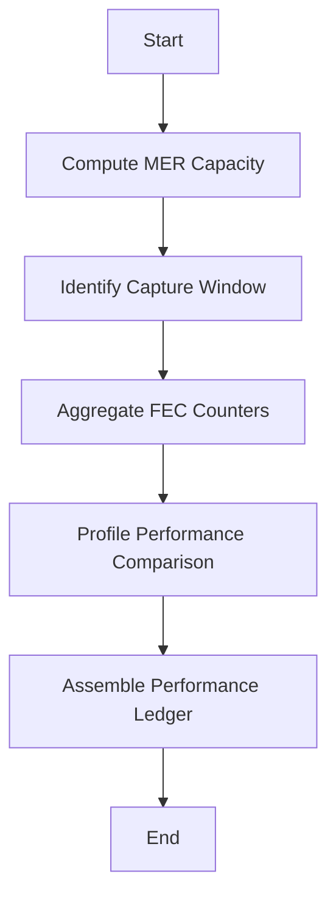

# OFDM Profile Performance Analysis - Part: 1

This guide outlines the theory and workflow for measuring DOCSIS 3.1 OFDM channel performance, quantifying capacity margins, and correlating them with error‑correction events.

## Mathematical Foundations

### 1. Shannon Capacity Limit

For each subcarrier, the theoretical maximum bits/sec/Hz is:

$$
C = \log_{2}\bigl(1 + \mathrm{SNR}_{\mathrm{lin}}\bigr),
$$

$$
\mathrm{SNR}_{\mathrm{lin}} = 10^{\mathrm{SNR}_{\mathrm{dB}} / 10}
$$

### 2. MER‑Derived Capacity

From the average Modulation Error Ratio (MER) in dB per subcarrier:

1. Convert to linear SNR: \$10^{\mathrm{MER}\_i/10}\$.
2. Apply Shannon’s formula.
3. Round down:

$$
C_{\mathrm{MER},i} = \left\lfloor \log_{2}\bigl(1 + 10^{\mathrm{MER}_i/10}\bigr) \right\rfloor.
$$

### 3. Profile‑Derived Capacity

Using configured per‑subcarrier SNR limits from the modulation profile:

$$
C_{\mathrm{profile},i} = \left\lfloor \log_{2}\bigl(1 + 10^{\mathrm{SNR}_{\mathrm{profile},i}/10}\bigr) \right\rfloor.
$$

### 4. Capacity Delta

The margin for each subcarrier:

$$
\Delta C_i = C_{\mathrm{profile},i} - C_{\mathrm{MER},i}.
$$

Positive \$\Delta C\$ indicates margin; negative signals under‑margin.

### 5. FEC Counter Aggregation

Over the capture interval $\[t\_0, t\_N]\$, sum forward‑error‑correction events:

$$
\mathrm{FEC}_{\mathrm{total}} = \sum_{t=t_0}^{t_N}\sum_j \mathrm{FEC}_j(t),
$$

where \$j\$ indexes FEC counters (corrected, uncorrectable, etc.).

## High-Level Workflow

1. **Compute MER Capacity**

   * Retrieve average MER per subcarrier.
   * Calculate \$C\_{\mathrm{MER},i}\$.

2. **Identify Capture Window**

   * Gather all timestamps.
   * Determine start \$t\_0\$ and end \$t\_N\$.

3. **Aggregate FEC Counters**

   * Sum FEC metrics for each codeword counter between \$t\_0\$ and \$t\_N\$.

4. **Profile Performance Comparison**
   For each capture timestamp and profile:

   * Compute \$C\_{\mathrm{profile},i}\$.
   * Calculate \$\Delta C\_i\$ per subcarrier.

5. **Assemble Performance Ledger**
   Compile per-channel results including:

   * Average MER and \$C\_{\mathrm{MER}}\$
   * Total FEC counts
   * Time‑series of \$\Delta C\$ for each profile

## Outcome

This process yields a structured performance ledger to:

* **Assess Capacity Margins**: Identify subcarriers with insufficient margin.
* **Correlate Reliability**: Link error‑correction events to capacity deficits.
* **Monitor Trends**: Track performance over time and detect transients.

## Workflow Flowchart

