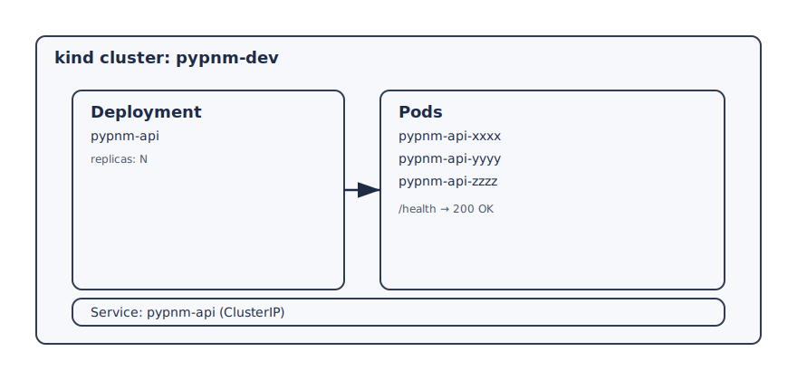

# PyPNM on Kubernetes (kind)

This walkthrough uses the manifests in `deploy/kubernetes/`. Start by installing kind and creating a cluster using [Local Kubernetes (kind) install](kind-install.md).

## Repo toolkit usage (recommended)

Use the toolkit to create a cluster and deploy from GHCR or local builds:

```bash
tools/k8s/pypnm_k8s_toolkit.sh --create --image-source ghcr --tag TAG_VALUE --replicas 1
```

Add `--namespace` when you want multiple isolated instances (for example, one PyPNM per CMTS):

```bash
tools/k8s/pypnm_k8s_toolkit.sh --create --image-source ghcr --tag TAG_VALUE --replicas 1 --namespace pypnm-cmts-a
```

If Docker or kubectl permissions require it, the toolkit will re-run itself with `sudo`.

## Script-only deploy (no repo clone)

This workflow pulls the manifests from GitHub and deploys the GHCR image directly.

```bash
curl -fsSL https://raw.githubusercontent.com/PyPNMApps/PyPNM/main/tools/k8s/pypnm_k8s_remote_deploy.sh \\
  -o /tmp/pypnm_k8s_remote_deploy.sh
TAG="v1.0.12.0"
NAMESPACE="pypnm-cmts-a"

bash /tmp/pypnm_k8s_remote_deploy.sh --create --tag "${TAG}" --namespace "${NAMESPACE}" --replicas 1
```

Local image:

```bash
tools/k8s/pypnm_k8s_toolkit.sh --create --image-source local --replicas 1
```

Teardown:

```bash
tools/k8s/pypnm_k8s_toolkit.sh --teardown --delete-cluster
```

## Diagram



## Build and load a local image

```bash
docker build -t pypnm:local --build-arg PYTHON_VERSION=3.12 .
kind load docker-image pypnm:local --name pypnm-dev
```

## Apply the manifests

```bash
kubectl apply -k deploy/kubernetes
kubectl get pods
```

## Health check

```bash
kubectl port-forward deploy/pypnm-api 8000:8000
curl -i http://127.0.0.1:8000/health
```

## Config overrides (non-interactive)

Create a patch configmap:

```bash
kubectl create configmap pypnm-config-patch \
  --from-file=patch.json=/path/to/patch.json \
  --dry-run=client -o yaml | kubectl apply -f -
```

Then add an initContainer to apply the patch into `/app/config/system.json`:

```yaml
initContainers:
  - name: config-apply
    image: pypnm:local
    command: ["python", "/app/tools/system_config/apply_config.py"]
    args:
      - "--input"
      - "/config-patch/patch.json"
      - "--config"
      - "/config/system.json"
    volumeMounts:
      - name: config-patch
        mountPath: /config-patch
      - name: pypnm-config
        mountPath: /config
volumes:
  - name: config-patch
    configMap:
      name: pypnm-config-patch
  - name: pypnm-config
    emptyDir: {}
```
