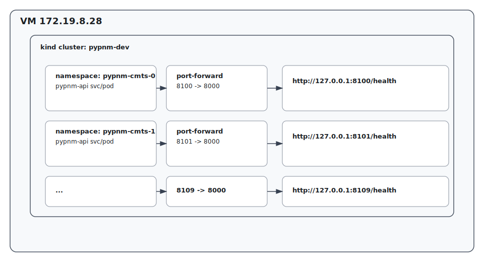

# 10 PyPNM instances on one kind cluster (ports 8100–8109)

This scenario runs 10 isolated PyPNM instances (one per namespace) on a single VM
and exposes each instance on a unique local port.

## Diagram



## Deploy 10 namespaces (parallel)

```bash
TAG="v1.0.13.0"
BASE_NS="pypnm-cmts"
REPLICAS="1"
COUNT="10"

export KUBECONFIG="${HOME}/.kube/config"
if ! kind get clusters | grep -q "^pypnm-dev$"; then
  kind create cluster --name pypnm-dev
fi
kubectl config use-context kind-pypnm-dev

curl -fsSL https://raw.githubusercontent.com/PyPNMApps/PyPNM/main/tools/k8s/pypnm_k8s_remote_deploy.sh \
  -o /tmp/pypnm_k8s_remote_deploy.sh

for i in $(seq 0 $((COUNT - 1))); do
  NAMESPACE="${BASE_NS}-${i}"
  bash /tmp/pypnm_k8s_remote_deploy.sh --create --tag "${TAG}" --namespace "${NAMESPACE}" --replicas ${REPLICAS} &
done
wait
```

## Start port-forwards (8100–8109)

```bash
BASE_PORT="8100"
BASE_NS="pypnm-cmts"
COUNT="10"
LOG_DIR="/tmp/pypnm-portforward"

mkdir -p "${LOG_DIR}"

for i in $(seq 0 $((COUNT - 1))); do
  NAMESPACE="${BASE_NS}-${i}"
  PORT=$((BASE_PORT + i))
  kubectl -n "${NAMESPACE}" port-forward deploy/pypnm-api ${PORT}:8000 \
    >"${LOG_DIR}/${NAMESPACE}.log" 2>&1 &
  echo $! >> "${LOG_DIR}/pids.txt"
done
```

## Verify

```bash
BASE_PORT="8100"
COUNT="10"

for i in $(seq 0 $((COUNT - 1))); do
  PORT=$((BASE_PORT + i))
  STATUS="$(curl -s http://127.0.0.1:${PORT}/health | sed -n 's/.*"status":"\\([^"]*\\)".*/\\1/p')"
  [ -z "${STATUS}" ] && STATUS="ok"
  echo "127.0.0.1:${PORT} -> ${STATUS}"
done
```

## Cleanup

```bash
BASE_NS="pypnm-cmts"
COUNT="10"
LOG_DIR="/tmp/pypnm-portforward"

if [ -f "${LOG_DIR}/pids.txt" ]; then
  xargs -r kill < "${LOG_DIR}/pids.txt"
  rm -f "${LOG_DIR}/pids.txt"
fi

for i in $(seq 0 $((COUNT - 1))); do
  NAMESPACE="${BASE_NS}-${i}"
  bash /tmp/pypnm_k8s_remote_deploy.sh --teardown --namespace "${NAMESPACE}"
done

kind delete cluster --name pypnm-dev
```
